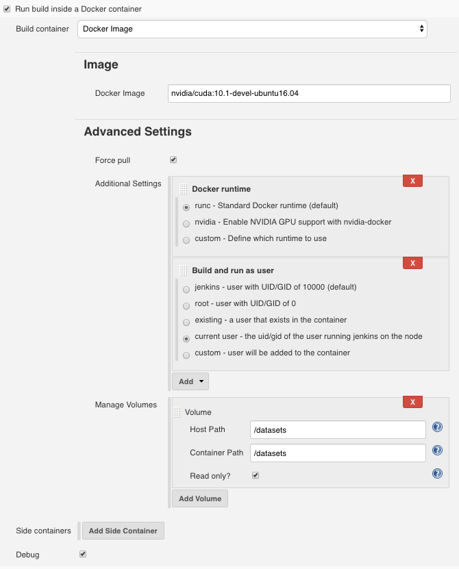

# Remote Docker Plugin

This a Jenkins plugin for delegating builds into a docker container on Jenkins agents.

The plugin also features first-class support for [nvidia-docker](https://github.com/NVIDIA/nvidia-docker) exposing the most common configuration options. This plugin makes it easy to allocate GPU devices using the 'executor' device visibility option. 

Since the docker containers run on individual Jenkins agents, you're still able to use labels to direct builds to specific agents. This is useful for labeling nodes with the type of GPUs available.

## Example Configuration

## Features

- Use image or Dockerfile for the container
- Run jobs in the container as a specific user
- Use specific Docker runtime
- Limit memory for the container
- Specify arbitrary environment variables in the container
- Mount volumes
- Run secondary side containers (for databases, webservers, etc) 
- nvidia-docker features
  - Choose GPU visibility
  - Choose driver capabilities
  - Choose minimum CUDA version

## Installation

1. Download the `.hpi` from the [releases](https://github.com/gpuopenanalytics/remote-docker-plugin/releases)
2. Upload it to your Jenkins instance at `http://<jenkins url>/pluginManager/advanced`

## FAQ

> Why not use [docker-slaves-plugin](https://github.com/jenkinsci/docker-slaves-plugin)?

Two reasons:

1. `docker-slaves-plugin` executes the docker container on either a globally defined docker URL or a job-specific URL. This plugin instead runs the build on a Jenkins agent and the agent delegates into a docker container based that node's docker configuration
2. `docker-slaves-plugin` doesn't support modifying the docker runtime (required support `nvidia-docker`)
   
> Do I need to have an NVIDIA GPU on my Jenkins agent to use this plugin?

Nope! This plugin works without any GPUs. You will be unable to use the `nvidia-docker` related settings, but builds can still run on agents and execute with docker.
